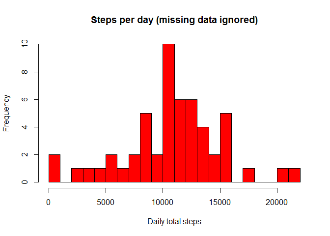
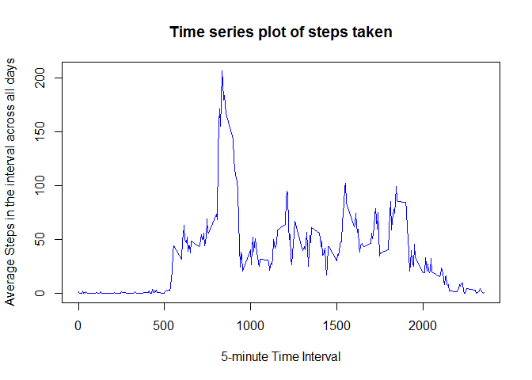
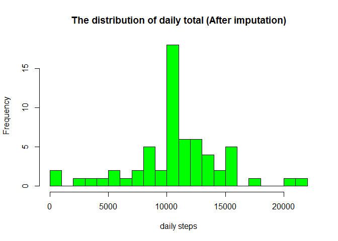
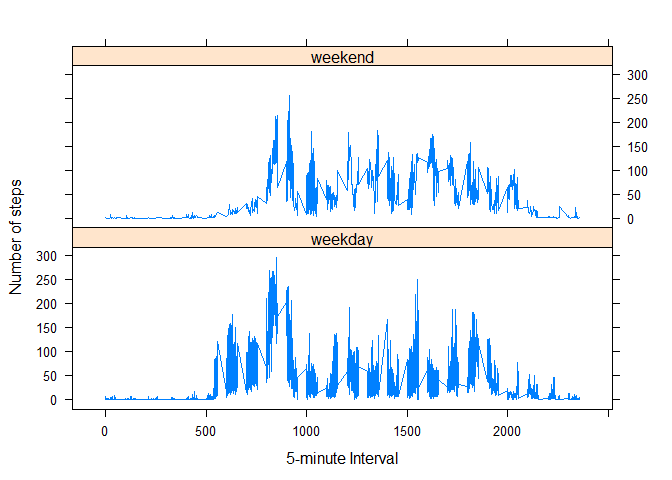
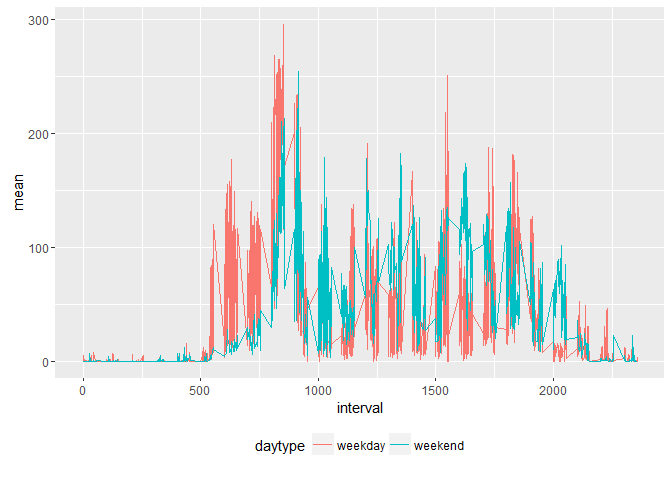

# Reproducible Research: Peer Assessment 1

Load all the necessary libraries and set the right options

```r
library(knitr)
library(lattice)
opts_chunk$set(tidy=TRUE)
```

## Loading and preprocessing the data
Link to data: [activity.zip](https://d396qusza40orc.cloudfront.net/repdata%2Fdata%2Factivity.zip)

> Show any code that is needed to
> 
> 1. Load the data (i.e. `read.csv()`)


```r
# Check if the data is downloaded and download when applicable
if (!file.exists("activity.zip")) {
    download.file(url = "https://d396qusza40orc.cloudfront.net/repdata%2Fdata%2Factivity.zip", 
        destfile = "activity.zip", mode = "wb")
}
# Unzip the data file.
if (!file.exists("activity.csv")) {
    unzip(zipfile = "activity.zip")
}
# Reading activity.csv:
data <- read.csv("activity.csv")
```

> 
> 2. Process/transform the data (if necessary) into a format suitable for your analysis


```r
# Add weekday from date
data$date <- as.Date(data$date)
```

## What is mean total number of steps taken per day?

> For this part of the assignment, you can ignore the missing values in the dataset.
> 
> 1. Make a histogram of the total number of steps taken each day


Calculating the total number of steps taken per day. Aggregate the number of steps taken each day. Days with missing values ( NA ) will have  NA  when aggregated. 


```r
steps_per_day <- aggregate(steps ~ date, data = data, sum, na.rm = TRUE)
```
> 
> 2. Make a histogram of the total number of steps taken each day

```r
hist(steps_per_day$steps, breaks = 25, xlab = "Daily total steps", ylab = "Frequency", 
    col = "red", main = "Steps per day (missing data ignored)")
```

<!-- -->


> 
> 3. Calculate and report the **mean** and **median** total number of steps taken per day

```r
cat("Mean:", mean(steps_per_day$steps))
```

```
## Mean: 10766.19
```

```r
cat("Median:", median(steps_per_day$steps))
```

```
## Median: 10765
```


## What is the average daily activity pattern?

> 
> 1. Make a time series plot (i.e. `type = "l"`) of the 5-minute interval (x-axis) and the average number of steps taken, averaged across all days (y-axis)

Aggregate the average number of steps taken by 5-minute interval.


```r
average_steps <- aggregate(steps ~ interval, data = data, mean, na.rm = TRUE)
```

Plot a time series of the 5-minute interval and the average number of steps taken across all days.


```r
plot(average_steps$interval, average_steps$steps, type = "l", col = "blue", 
    xlab = "5-minute Time Interval", ylab = "Average Steps in the interval across all days", 
    main = "Time series plot of steps taken")
```

<!-- -->

> 
> 2. Which 5-minute interval, on average across all the days in the dataset, contains the maximum number of steps?

Locate when the maximum steps happened in the time series

```r
max_steps <- which(average_steps$steps == max(average_steps$steps))
cat("Interval with maximum steps: ", average_steps[max_steps, 1])
```

```
## Interval with maximum steps:  835
```

## Imputing missing values

> Note that there are a number of days/intervals where there are missing
> values (coded as `NA`). The presence of missing days may introduce
> bias into some calculations or summaries of the data.
> 
> 1. Calculate and report the total number of missing values in the dataset (i.e. the total number of rows with `NA`s)

Calculating total number of missing values in the dataset and report it.


```r
cat("Number of records with NA is", sum(is.na(data$steps)))
```

```
## Number of records with NA is 2304
```


> 
> 2. Devise a strategy for filling in all of the missing values in the dataset. The strategy does not need to be sophisticated. For example, you could use the mean/median for that day, or the mean for that 5-minute interval, etc.

All of the missing values will filled in with mean value for that 5-minute interval.
Count a simple approximation for steps per interval from the daily averages.


```r
# Find the missing indices
index_missing <- is.na(data$steps)
# dataset without NA
data_clear <- subset(data, !is.na(data$steps))  #clear data
# count mean for each 5-min intervals.
data_mean <- tapply(data_clear$steps, data_clear$interval, mean, na.rm = TRUE, 
    simplify = T)
```


> 
> 3. Create a new dataset that is equal to the original dataset but with the missing data filled in.


```r
# Create a copy of the original dataset
data_imputed <- data
# Replace each missing value NA with the mean value of its 5-minute
# interval.
data_imputed$steps[index_missing] <- data_mean[as.character(data_imputed$interval[index_missing])]
```


> 4. Make a histogram of the total number of steps taken each day and Calculate and report the **mean** and **median** total number of steps taken per day. Do these values differ from the estimates from the first part of the assignment? What is the impact of imputing missing data on the estimates of the total daily number of steps?


```r
data_sumary_by_date <- tapply(data_imputed$steps, data_imputed$date, sum, na.rm = TRUE, 
    simplify = T)

hist(x = data_sumary_by_date, col = "green", breaks = 20, xlab = "daily steps", 
    ylab = "Frequency", main = "The distribution of daily total (After imputation)")
```

<!-- -->

```r
mean(data_sumary_by_date)
```

```
## [1] 10766.19
```

```r
median(data_sumary_by_date)
```

```
## [1] 10766.19
```

The **mean** and **median** are same as they were for the data set that omitted "NA" values.  This is because the "NA" values were replaced by the *clean* data set's average value. The one noticeable change occurs in the histogram, where the most frequent range of daily steps taken increased in frequency.  This is due to the days with "NA" values being assigned the mean, pushing that range higher.  


## Are there differences in activity patterns between weekdays and weekends?

> For this part the `weekdays()` function may be of some help here. Use
> the dataset with the filled-in missing values for this part.
> 
> 1. Create a new factor variable in the dataset with two levels -- "weekday" and "weekend" indicating whether a given date is a weekday or weekend day.


```r
# Add character column for day of the week
data_imputed <- data.frame(steps = data_imputed$steps, date = data_imputed$date, 
    dayofweek = tolower(weekdays(data_imputed$date)), interval = data_imputed$interval)
# Append a daytype column to distinguish between weekday and weekend
data_imputed <- cbind(data_imputed, daytype = ifelse(data_imputed$dayofweek %in% 
    c("saturday", "sunday"), "weekend", "weekday"))
```

> 
> 1. Make a panel plot containing a time series plot (i.e. `type = "l"`) of the 5-minute interval (x-axis) and the average number of steps taken, averaged across all weekday days or weekend days (y-axis). 
 

```r
# Compute the time series
data_type <- aggregate(data_imputed$steps, by = list(data_imputed$daytype, data_imputed$dayofweek, 
    data_imputed$interval), mean)
```

Plot two time series (one for weekdays and the other for weekends) of the 5-minute intervals and average number of steps taken (imputed values).


```r
# Rename the attributes
names(data_type) <- c("daytype", "weekday", "interval", "mean")
# Plot the data
xyplot(mean ~ interval | factor(daytype), data = data_type, type = "l", lwd = 1, 
    xlab = "5-minute Interval", ylab = "Number of steps", layout = c(1, 2))
```

<!-- -->

It's not easy to discern differences. So overlay the time series on a single plot instead of using a panel plot.


```r
library(ggplot2)
ggplot(data_type, aes(x = interval, y = mean, color = daytype)) + geom_line() + 
    theme(legend.position = "bottom")
```

<!-- -->

The results will be a little easier to interpret. On average, steps are higher on the weekend, although the maximum for steps is highest on weekday mornings at 8:30. In weekday mean steps begin rise from 5:00 and continue rise till maximum ~8:40.
